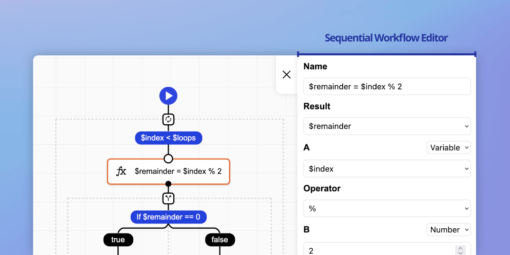

# Sequential Workflow Editor

[](https://github.com/nocode-js/sequential-workflow-editor/actions) [](/LICENSE) [](https://npmjs.org/package/sequential-workflow-editor)

Powerful workflow editor builder for sequential workflows. Written in TypeScript. Mainly designed to work with the [Sequential Workflow Designer](https://github.com/nocode-js/sequential-workflow-designer) component. To execute your model you may use the [Sequential Workflow Machine](https://github.com/nocode-js/sequential-workflow-machine) or any other workflow engine. It supports front-end and back-end strict validation of the model. 0 external dependencies.

📝 Check the [documentation](https://nocode-js.com/docs/category/sequential-workflow-editor) for more details.

🤩 Don't miss [the pro version](https://nocode-js.com/sequential-workflow-editor-pro/pricing).

## 👀 Examples

* [🛠 Playground](https://nocode-js.github.io/sequential-workflow-editor/webpack-app/public/playground.html)
* [📖 Editors](https://nocode-js.github.io/sequential-workflow-editor/webpack-app/public/editors.html)
* [🎯 Placement Restrictions](https://nocode-js.github.io/sequential-workflow-editor/webpack-app/public/placement-restrictions.html)
* [🚩 Internationalization](https://nocode-js.github.io/sequential-workflow-editor/webpack-app/public/i18n.html)
* [🚢  Vanilla JS](https://nocode-js.github.io/sequential-workflow-editor/vanilla-js-app/vanilla-js.html)

Pro:

* [📖 Pro Editors](https://nocode-js.com/examples/sequential-workflow-editor-pro/webpack-pro-app/public/editors.html)
* [📫 Template System](https://nocode-js.com/examples/sequential-workflow-editor-pro/webpack-pro-app/public/template-system.html)
* [🎱 Dynamic Variables](https://nocode-js.com/examples/sequential-workflow-editor-pro/webpack-pro-app/public/dynamic-variables.html)

## 🚀 Installation

Install the `sequential-workflow-editor-model` package in your front-end project or your common project for front-end and back-end (check [this article](https://nocode-js.com/docs/sequential-workflow-designer/sharing-types-between-frontend-and-backend)):

```
npm i sequential-workflow-editor-model
```

Install the `sequential-workflow-editor` package in your front-end project:

```
npm i sequential-workflow-editor
```

## 🎬 Usage

At the beginning you need to create a model of your workflow for the editor. In this short tutorial let's consider the following workflow:

```ts
import { Definition, Step } from 'sequential-workflow-model';

export interface MyDefinition extends Definition {
  properties: {
    inputs: VariableDefinitions;
  };
}

export interface LogStep extends Step {
  type: 'log';
  componentType: 'task';
  properties: {
    message: string;
  };
}
```

Now we can create a model for the step:

```ts
import { createStepModel, createStringValueModel } from 'sequential-workflow-editor-model';

export const logStepModel = createStepModel<LogStep>('log', 'task', step => {
  step.property('message')
    .value(
      createStringValueModel({
        minLength: 1
      })
    )
    .label('Message to log');
});
```

If your workflow contains global properties you can create a root model:

```ts
import { createRootModel, createVariableDefinitionsValueModel } from 'sequential-workflow-editor-model';

export const rootModel = createRootModel<MyDefinition>(root => {
  root.property('inputs')
    .value(
      createVariableDefinitionsValueModel({})
    );
);
```

Now we can create a definition model:

```ts
import { createDefinitionModel } from 'sequential-workflow-editor-model';

export const definitionModel = createDefinitionModel<MyDefinition>(model => {
  model.valueTypes(['string', 'number']);
  model.root(rootModel);
  model.steps([logStepModel]);
});
```

To create an editor provider you need to pass a definition model to the `EditorProvider.create` method. The provider requires a unique identifier generator. You can use the `Uid` class from the `sequential-workflow-designer` package.

```ts
import { EditorProvider } from 'sequential-workflow-editor';
import { Uid } from 'sequential-workflow-designer';

export const editorProvider = EditorProvider.create(definitionModel, {
  uidGenerator: Uid.next
});
```

We have everything to attach the editor provider to a designer. For the Sequential Workflow Designer you need to pass the following options:

```ts
import { Designer } from 'sequential-workflow-designer';

const designer = Designer.create(placeholder, startDefinition, {
  editors: {
    rootEditorProvider: editorProvider.createRootEditorProvider(),
    stepEditorProvider: editorProvider.createStepEditorProvider()
  },
  validator: {
    step: editorProvider.createStepValidator(),
    root: editorProvider.createRootValidator()
  },
  // ...
});
```

That's it! Check the source code of [our demo](./demos/webpack-app/) to see the final code.

## 💡 License

This project is released under the MIT license.
